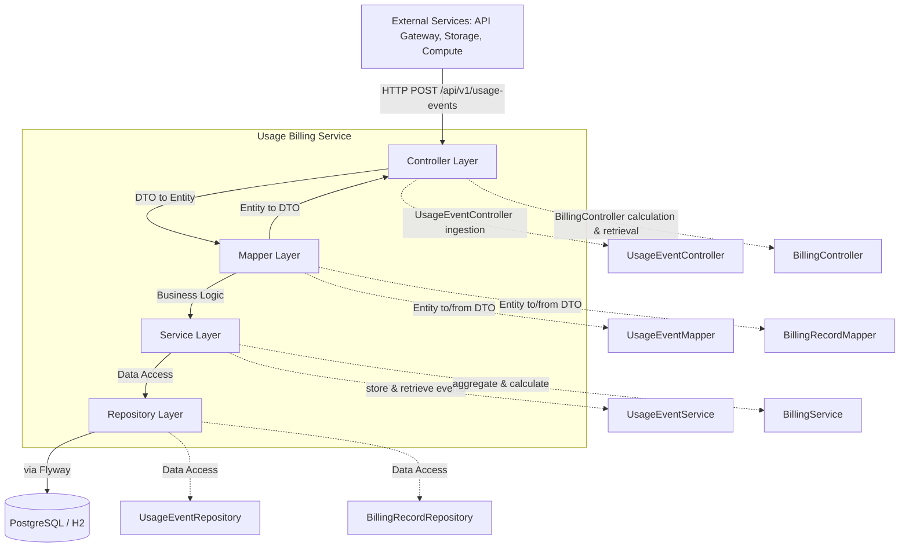
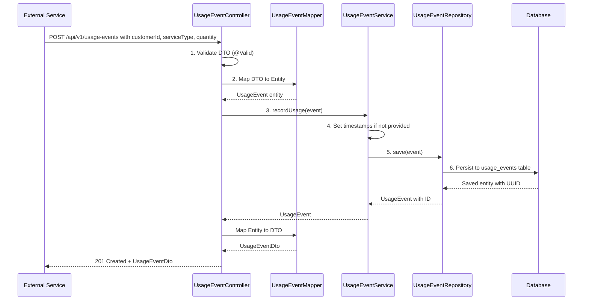
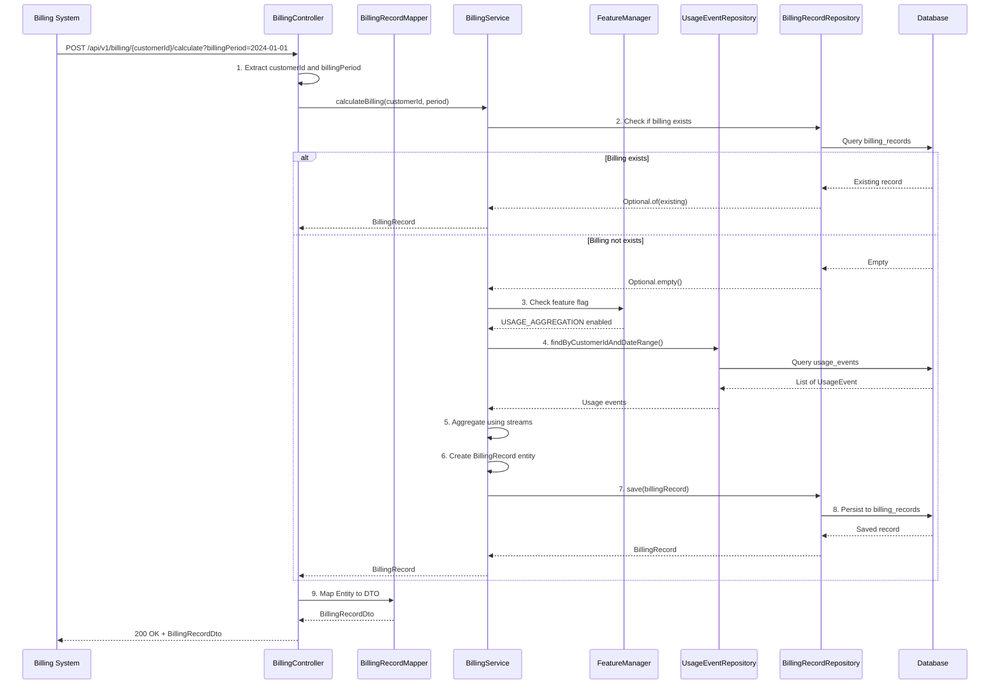
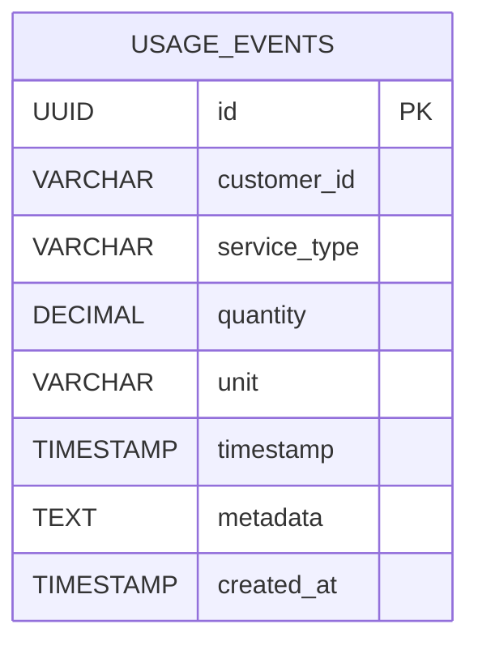
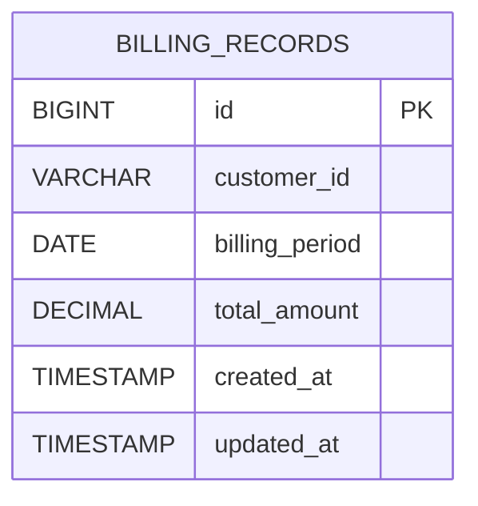

# Usage-Based Billing Service - Architecture & Design

## Design Philosophy

This service follows a **stateless, event-driven architecture** where:
- **Usage events are immutable** - once recorded, they cannot be modified (only new events can be added)
- **Billing is calculated on-demand** - not pre-computed, allowing for flexible pricing changes
- **Separation of concerns** - clear boundaries between data ingestion, storage, and calculation
- **Idempotency** - calculating billing multiple times for the same period returns the same result

## High-Level Architecture



## Request Lifecycle

### 1. Recording Usage Events (Write Path)



**Key Points:**
- **Fast write path** - minimal processing, just validate and store
- **Asynchronous-friendly** - events can be processed later
- **Audit trail** - every event has timestamp and metadata

### 2. Calculating Billing (Read-Aggregate-Write Path)



**Key Points:**
- **Idempotent** - calling multiple times returns same result
- **Period-based** - calculates for specific billing period (typically monthly)
- **Lazy calculation** - only calculates when requested
- **Stream-based aggregation** - demonstrates functional programming

## Data Model

### UsageEvent (Time-Series Data)



**Characteristics:**
- **Append-only** - events are never updated or deleted
- **High volume** - can receive millions of events per day
- **Time-ordered** - indexed by timestamp for efficient range queries

### BillingRecord (Aggregated Data)



**Characteristics:**
- **Aggregated** - represents sum of all usage events for a period
- **Immutable once created** - prevents accidental recalculation
- **Query-optimized** - fast lookups by customer and period

## Billing Calculation Logic

### Current Implementation (Simple Rate Model)

```java
// Step 1: Get all usage events for the period
List<UsageEvent> events = repository.findByCustomerIdAndDateRange(
    customerId, periodStart, periodEnd
);

// Step 2: Sum all quantities
BigDecimal totalQuantity = events.stream()
    .map(UsageEvent::getQuantity)
    .reduce(BigDecimal.ZERO, BigDecimal::add);

// Step 3: Apply rate
BigDecimal totalAmount = totalQuantity.multiply(RATE_PER_UNIT);
```

### Future Enhancements (Extensible Design)

The service is designed to support:

1. **Tiered Pricing:**
   ```java
   // Different rates based on volume
   if (totalQuantity < 1000) {
       rate = 0.01;
   } else if (totalQuantity < 10000) {
       rate = 0.008;  // Volume discount
   } else {
       rate = 0.005;  // Higher volume discount
   }
   ```

2. **Service-Specific Rates:**
   ```java
   // Different rates per service type
   Map<String, BigDecimal> rates = Map.of(
       "api-calls", new BigDecimal("0.01"),
       "storage", new BigDecimal("0.10"),  // per GB
       "compute", new BigDecimal("0.50")   // per hour
   );
   ```

3. **Time-Based Pricing:**
   ```java
   // Peak vs off-peak pricing
   if (isPeakHours(event.getTimestamp())) {
       rate = baseRate.multiply(new BigDecimal("1.5"));
   }
   ```

## Stream Operations - Design Patterns

### Pattern 1: Entity to DTO Mapping

```java
// Single entity
UsageEventDto dto = mapper.mapToDto(entity);

// Collection mapping
List<UsageEventDto> dtos = events.stream()
    .map(mapper::mapToDto)
    .collect(Collectors.toList());
```

**Why:** Clean separation, testable, reusable

### Pattern 2: Aggregation

```java
// Sum quantities
BigDecimal total = events.stream()
    .map(UsageEvent::getQuantity)
    .reduce(BigDecimal.ZERO, BigDecimal::add);
```

**Why:** Functional, immutable, parallelizable

### Pattern 3: Grouping

```java
// Group by service type and sum
Map<String, BigDecimal> byService = events.stream()
    .collect(Collectors.groupingBy(
        UsageEvent::getServiceType,
        Collectors.reducing(
            BigDecimal.ZERO,
            UsageEvent::getQuantity,
            BigDecimal::add
        )
    ));
```

**Why:** Single-pass aggregation, efficient, readable

## Error Handling & Edge Cases

### 1. Duplicate Billing Calculation

**Scenario:** Calculate billing twice for the same period

**Solution:** Idempotency check
```java
return billingRecordRepository
    .findByCustomerIdAndBillingPeriod(customerId, billingPeriod)
    .orElseGet(() -> calculateAndSaveBilling(...));
```

### 2. No Usage Events

**Scenario:** Customer has no usage events in a period

**Solution:** Return zero amount
```java
BigDecimal totalAmount = usageEvents.stream()
    .map(UsageEvent::getQuantity)
    .reduce(BigDecimal.ZERO, BigDecimal::add)  // Returns ZERO if empty
    .multiply(RATE_PER_UNIT);
```

### 3. Feature Flag Disabled

**Scenario:** Usage aggregation feature is disabled

**Solution:** Explicit check with clear error
```java
if (!Features.USAGE_AGGREGATION.isActive()) {
    throw new IllegalStateException("Usage aggregation is disabled");
}
```

### 4. Invalid Date Ranges

**Scenario:** Query with invalid date range

**Solution:** Repository query handles it
```java
// Returns empty list if no events in range
List<UsageEvent> events = repository.findByCustomerIdAndDateRange(...);
```

## Scalability Considerations

### Current Design (MVP)

- **Single instance** - suitable for moderate load
- **Synchronous processing** - simple but blocking
- **In-memory aggregation** - works for reasonable data volumes

### Future Scalability Patterns

1. **Event Sourcing:**
   - Store events in event store (Kafka, EventStore)
   - Replay events for recalculation
   - Supports audit and time-travel queries

2. **CQRS (Command Query Responsibility Segregation):**
   - Write: Fast event ingestion
   - Read: Pre-aggregated views (materialized views)

3. **Batch Processing:**
   - Process events in batches
   - Use scheduled jobs for aggregation
   - Store pre-calculated billing records

4. **Caching:**
   - Cache billing records (Redis)
   - Cache aggregated usage by service type
   - TTL-based invalidation

5. **Partitioning:**
   - Partition `usage_events` by customer_id or date
   - Shard database for high-volume customers

## Integration Points

### 1. External Services (Producers)

**How they integrate:**
- HTTP POST to `/api/v1/usage-events`
- Can be synchronous (wait for response) or asynchronous (fire-and-forget)
- Should include retry logic for transient failures

**Example integration:**
```java
// In API Gateway
@PostMapping("/api/users")
public ResponseEntity<User> getUsers() {
    // ... business logic ...
    
    // Record usage
    usageBillingClient.recordUsage(
        customerId, "api-calls", 1, "requests"
    );
    
    return ResponseEntity.ok(user);
}
```

### 2. Billing System (Consumer)

**How it integrates:**
- Calls `/api/v1/billing/{customerId}/calculate` at end of billing period
- Retrieves billing records via `/api/v1/billing/{customerId}`
- Generates invoices from billing records

**Example integration:**
```java
// Scheduled job (cron)
@Scheduled(cron = "0 0 1 * * ?")  // First day of month
public void calculateMonthlyBilling() {
    List<String> customers = getActiveCustomers();
    
    customers.forEach(customerId -> {
        LocalDate period = LocalDate.now().minusMonths(1)
            .withDayOfMonth(1);
        
        billingService.calculateBilling(customerId, period);
    });
}
```

## Testing Strategy

### Unit Tests
- **Mappers:** Test entity ↔ DTO conversion
- **Services:** Mock repositories, test business logic
- **Stream operations:** Test aggregation logic

### Integration Tests
- **Repository:** Test database queries with Testcontainers
- **Controller:** Test HTTP endpoints with MockMvc
- **End-to-end:** Test full request lifecycle

### Test Data Patterns
```java
// Builder pattern for test data
UsageEvent event = UsageEvent.builder()
    .customerId("test-customer")
    .serviceType("api-calls")
    .quantity(new BigDecimal("100"))
    .unit("requests")
    .timestamp(LocalDateTime.now())
    .build();
```

## Monitoring & Observability

### Key Metrics
- **Ingestion rate:** Events per second
- **Billing calculation time:** P50, P95, P99 latencies
- **Error rate:** Failed requests / Total requests
- **Database query performance:** Query execution times

### Logging Strategy
- **Structured logging:** JSON format for parsing
- **Correlation IDs:** Track requests across services
- **Log levels:** DEBUG for development, INFO for production

## Summary

This service is designed as a **stateless, event-driven microservice** that:

1. **Ingests usage events** asynchronously (fast write path)
2. **Aggregates on-demand** when billing is calculated (flexible read path)
3. **Uses streams** for efficient, functional data processing
4. **Separates concerns** with clear layers (Controller → Mapper → Service → Repository)
5. **Scales horizontally** through stateless design
6. **Extends easily** through feature flags and modular design

The architecture prioritizes **simplicity and clarity** while maintaining **extensibility** for future requirements like tiered pricing, multi-currency, and advanced analytics.

